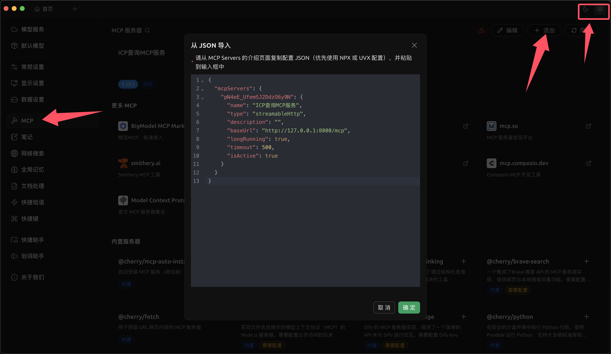
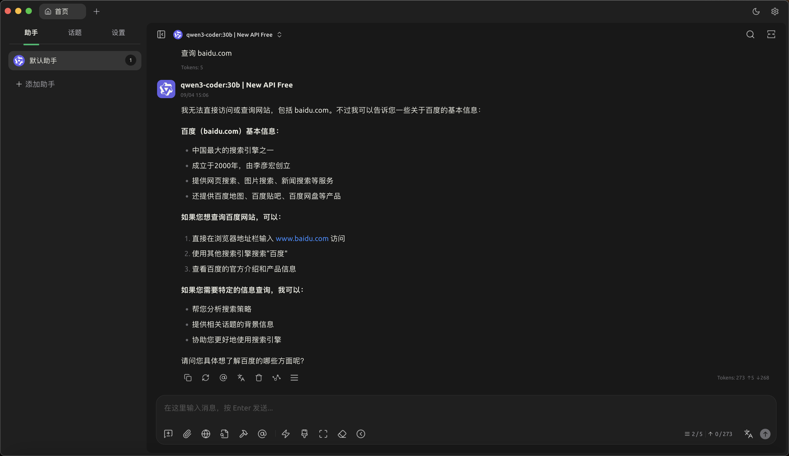
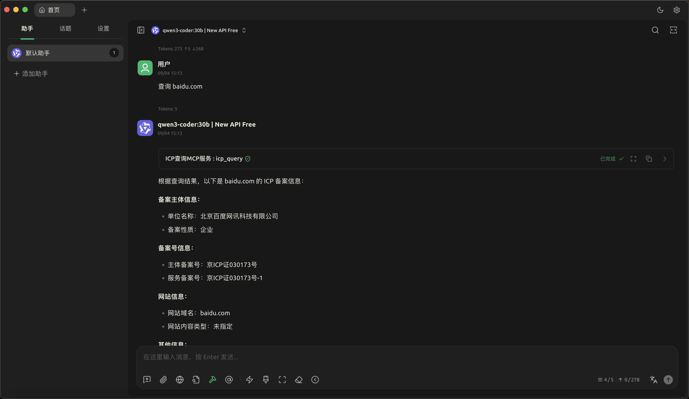

<h4 align="center">ICP-MCP 是一个基于 Python 的 MCP 服务器，提供 ICP 备案查询工具。</h4>

<p align="center">
<a href="https://github.com/wjlin0/icp-mcp/releases/"></a> 
<a href="https://github.com/wjlin0/icp-mcp" ></a>
<a href="https://github.com/wjlin0/icp-mcp/releases"></a> 
<a href="https://github.com/wjlin0/icp-mcp"></a> 
<a href="https://www.wjlin0.com/"></a>
</p>
# 特性

- 基于 [MCP](https://modelcontextprotocol.io/) 协议的 ICP 备案信息查询工具
- 内置小模型搜索ICP备案。
- 内置缓存机制，提高查询效率
- 支持分页查询与结果分析提示词

# 安装

## 环境要求

- Python 3.10+

## 安装依赖

```bash
pip install -r requirements.txt
```

# 运行方式


## HTTP 模式

```bash
python server.py --transport streamable-http --host 127.0.0.1 --port 8000
```
## Docker 
```bash
docker run --name icp-mcp -p 127.0.0.1:8000:8000 -itd registry.cn-hangzhou.aliyuncs.com/wjlin0/icp-mcp:latest
```
# 使用方法

在支持 MCP 协议的客户端 中连接到该服务，即可使用 `icp_query` 工具进行ICP备案查询。
## 导入Cherry Studio

运行服务后，替换下方的配置信息，然后复制

```json
{
  "mcpServers": {
    "pN4eE_UfemSJ2DdzO6y9N": {
      "name": "ICP查询MCP服务",
      "type": "streamableHttp",
      "description": "",
      "baseUrl": "http://127.0.0.1:8000/mcp",
      "longRunning": true,
      "timeout": 500,
      "isActive": true
    }
  }
}
```

将上述JSON 写入 `设置`-> `MCP`->`添加`->`从JSON导入`



完成后可前往首页使用，这是未导入`icp-mcp`时，无法查询



这是导入后`icp-mcp`的查询




## 工具说明

### icp_query

查询指定关键词的ICP备案信息。

**参数:**
- `keyword`: 查询关键词，可以是公司名、备案号或域名
- `page`: 查询页数 (默认为 1)

**返回:**
包含分页信息和备案记录的字典。

### analyze_icp 提示词

分析ICP备案查询结果，提供专业的网络安全和合规分析建议。

# 项目结构

```
src/
├── server.py        # MCP 服务主入口
├── cache_utils.py   # 缓存工具
├── requirements.txt # 依赖列表
├── icp/             # ICP 查询核心模块
│   ├── __init__.py
│   ├── app.py       # 查询入口
│   ├── query.py     # 核心查询逻辑
│   └── crack.py     # 验证码识别
└── *.onnx           # 验证码识别模型文件
```
